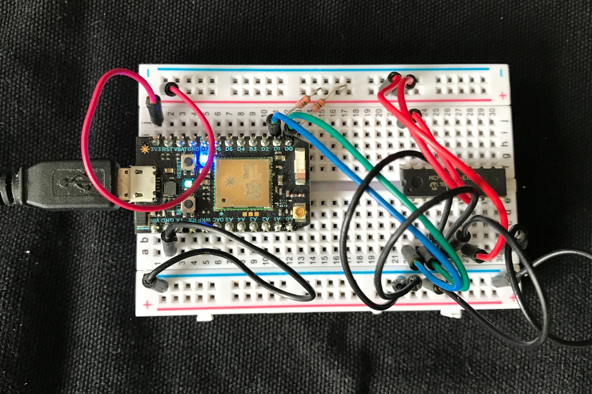
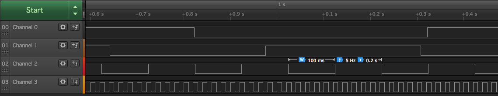

# MCP23008-RK
*Particle driver for MCP23008 8-port I2C GPIO expander*


## Pinouts

One Side:

- 1 SCL (to Photon D1, blue)
- 2 SDA (to Photon D0, green)
- 3 A2
- 4 A1
- 5 A0
- 6 /RESET
- 7 NC 
- 8 INT (output)
- 9 VSS (GND, black)

Other Side:

- 10 GP0
- 11 GP1
- 12 GP2
- 13 GP3
- 14 GP4
- 15 GP5
- 16 GP6
- 17 GP7
- 18 VDD (3.3 or 5V, red)

Note that the address lines are not biased so you must connect them to GND or VDD to set the address! Normally you'd connect all to GND to set address 0.

Same for /RESET, though you probably want to connect that to VDD to keep the device out of reset.

Here's my test circuit:



Important: Remember the pull-ups on the SDA and SCL lines (4.7K or 10K typically)! While many breakout boards like you'd get from Adafruit or Sparkfun includes the pull-ups on the board, you must add external resistors when using a bare MCP23008.

## Using the Library

This library has an API that looks remarkably like the regular GPIO calls.

### Initialization

Typically you create an global object like this in your source:

```
MCP23008 gpio(Wire, 0);
```

The first parameter is the interface. It's typically Wire (D0 and D1). 

The second parameter is the address of the device (0-7). This corresponds to the value set on the A0, A1, and A2 pins and allows up to 8 separate MCP23008 devices on a single I2C bus.

On the Electron, you can also use Wire1 on C4 and C5:

```
MCP23008 gpio(Wire1, 0);
```

### begin

```
void begin();
```

You must call begin(), typically during setup(), to initialize the Wire interface.

### pinMode

```
void pinMode(uint16_t pin, PinMode mode);
```

Sets the pin mode of a pin (0-7). Values for mode include:

- INPUT (default)
- INPUT_PULLUP
- OUTPUT

Note that it does not support INPUT_PULLDOWN, as the MCP23008 only supports internal pull-ups. Also, they're 100K vs. the 40K (-ish) pull-ups in the STM32F205.

### digitalWrite

```
void digitalWrite(uint16_t pin, uint8_t value);
```

Sets the value of a pin (0-7) to the specified value. Values are typically:

- 0 (or false or LOW)
- 1 (or true or HIGH)

### digitalRead

```
int32_t digitalRead(uint16_t pin);
```

Reads the value of the pin (0-7). This will be HIGH (true, 1) or LOW (false, 0).

If used on an output pin, returns the current output state.


### getPinMode

```
PinMode getPinMode(uint16_t pin);
```

Returns the pin mode of pin (0-7), which will be one of:

- INPUT (default)
- INPUT_PULLUP
- OUTPUT

### pinAvailable

```
bool pinAvailable(uint16_t pin);
```

Returns true if 0 <= pin <= 7.
	
## Example Programs


### Simple Example

```
#include "Particle.h"
#include "MCP23008-RK.h"

MCP23008 gpio(Wire, 0);

void setup() {
	Serial.begin(9600);

	gpio.begin();
	gpio.pinMode(0, OUTPUT);
	gpio.digitalWrite(0, HIGH);
}

void loop() {
}
```

### Other Example

The other example outputs a square wave on pins 0 - 3:

- GP0: 1000 ms. period (1 Hz)
- GP1: 666 ms. period
- GP2: 200 ms. period (5 Hz)
- GP3: 20 ms. period (50 Hz)

This should result in the following:



You can also connect a jumper from GP7 to one of those pins. It echoes the value on the GP7 input to the blue D7 LED on the Photon, so you can see the different frequencies.


